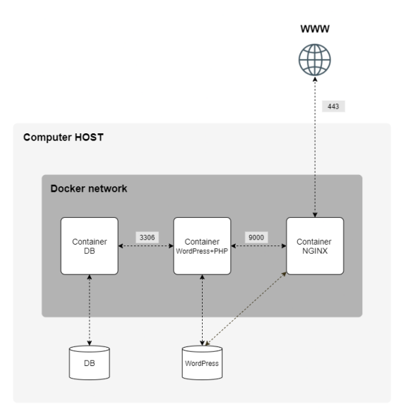

# Inception - Dockerized Web Infrastructure

> A from-scratch Docker implementation of a complete web infrastructure, featuring custom-built NGINX, WordPress, and MariaDB containers based on Debian images. 
> Automated orchestration through Docker Compose enables one-command deployment of a fully connected web application with database integration.


## 🏗️ Architecture Overview

This project implements a complete web stack using Docker containers:



## ✨ Features

- **Custom Docker Images** - Built from scratch using only Debian 11 base images
- **TLS Encryption** - HTTPS-only with SSL/TLS certificates
- **NGINX Reverse Proxy** - High-performance web server and reverse proxy
- **WordPress PHP** - Full-featured content management system
- **MariaDB Database** - Reliable MySQL-compatible database
- **Docker Compose** - Orchestrated multi-container deployment
- **Custom Configuration** - No pre-built images, everything configured manually
- **Persistent Volumes** - Data persistence across container restarts

## 🛠️ Tech Stack

**Containerization:**
- **Docker Compose** - Multi-container orchestration
- **Dockerfile** - custom image building configuration
- **Debian 11 (Bullseye)** - Base operating system for all containers

**Web Stack:**
- **NGINX 1.18** - Web server and reverse proxy with TLS
- **PHP 8.3-FPM** - FastCGI Process Manager for WordPress
- **WordPress 6.x** - Content Management System
- **MariaDB 10.5** - Database server

**Security & Networking:**
- **TLS 1.2** - Modern encryption protocols
- **Docker Networks** - Isolated container communication using Docker Network configuration
- **Docker Volume** - Creating persistency accross folders for database and wordpress containers

- **Environment Variables** - Secure configuration management using 

## 🚀 Quick Start

### Prerequisites
- Docker Engine 20.10+
- Docker Compose 2.0+
- Make (optional)

### Installation

1. **Clone the repository**
   ```bash
   git clone https://github.com/yourusername/inception.git inception
   cd inception
   ```

2. **Set up environment variables**
   ```bash
   # In a secure location in your machine, create a hidden folder ./secrets in a secure location
   mkdir ./secrets && cd

   # Create and configure your .env
   vim .env

   #In your editor add the following information
		#mariadb-database-info
		DATABASE=Name
		DB_ROOT_PWD=Root_password
		DB_ADMIN_ID=Root_ID
		DB_ID=User_ID
		DB_PWD=User_password
		DB_HOST=mariadb

		#wordpress-indo
		DOMAINE_NAME=your_domain_name
		SITE_URL=https://ypour_domain_name.fr
		SITE_TITLE=Inception_Project
		WP_ADMIN_ID=Admin_use
		WP_ADMIN_PWD=YourPassword
		ADMIN_EMAIL=example@email.com
		WP_PATH=/var/www/wordpress
   ```

3. **Update docker-compose.yaml paths to environment variable file and docker volumes**
	##### Update the path to your .env file: 
	```yaml
	env_file:
	  - .FOLDER_PATH/.filename
	```
	##### Update the path to your future volumes folder:
	```yaml
	volumes:
  	  mariadb-volume:
        driver_opts:
          type: none
          device: /home/cofische/data/mariadb
	      o: bind
	```

4. **Build and start the infrastructure**
   ```bash
   # using Makefile
   make up

   # using Docker 
   docker-compose -f srcs/docker-compose.yml up --build
   ```

5. **Access your site**

   - **HTTPS:** `https://your_domain_name` -- if you are unable to configure your domain_name, you can use https://localhost instead
   - **WordPress Admin:** `https://your_domain_name/wp-admin`

### Quick Commands

```bash
make up      # Build and start all services
make down    # Stop and remove containers
make clean   # Remove containers, images, and volumes
make re      # Full rebuild (clean + up)
make logs    # View container logs
```

## 📁 Project Structure

```
For security purpose, your .environment file has to be store in your machine under ./secrets folder
├── .secrets/
|      ├── .env
|

inception/
├── srcs/
│   ├── docker-compose.yml     # Container orchestration
│   └── requirements/
│       ├── nginx/
│       │   ├── Dockerfile     # NGINX container config
│       │   ├── conf/          # NGINX configuration files
│       │   └── tools/         # Setup scripts
│       ├── wordpress/
│       │   ├── Dockerfile     # WordPress container config
│       │   ├── conf/          # PHP-FPM configuration
│       │   └── tools/         # WordPress setup scripts
│       └── mariadb/
│           ├── Dockerfile     # MariaDB container config
│           ├── conf/          # Database configuration
│           └── tools/         # Database initialization
├── Makefile                   # Build automation
└── README.md
```

## 🔧 Configuration

### Container Details

#### NGINX Container
- **Base Image:** `debian:bullseye`
- **Purpose:** TLS termination and reverse proxy
- **Features:** SSL/TLS certificates, HTTP to HTTPS redirect
- **Port:** 443 (HTTPS)

#### WordPress Container
- **Base Image:** `debian:bullseye`
- **Purpose:** Dynamic content generation
- **Features:** PHP-FPM, WordPress CLI, custom themes
- **Port:** 9000 (FastCGI)

#### MariaDB Container
- **Base Image:** `debian:bullseye`
- **Purpose:** Database storage and management
- **Features:** Custom database initialization, user management
- **Port:** 3306 (MySQL protocol)

## Docker Implementation

### Custom Dockerfiles

Each service uses a custom Dockerfile built from Debian:

```dockerfile
# Example: NGINX Dockerfile structure
FROM debian:bullseye

RUN apt-get update && apt-get install -y \
    nginx \
    openssl \
    && rm -rf /var/lib/apt/lists/*

COPY conf/nginx.conf /etc/nginx/nginx.conf
COPY tools/setup.sh /usr/local/bin/
RUN chmod +x /usr/local/bin/setup.sh

EXPOSE 443
CMD ["setup.sh"]
```

### Network Architecture
- **Custom Bridge Network** - Isolated communication between containers
- **No Host Network** - Enhanced security through network isolation
- **Internal DNS** - Container name resolution within the network

### Volume Management
- **WordPress Files** - Persistent WordPress installation and uploads
- **Database Data** - MariaDB data directory persistence
- **TLS Certificates** - SSL certificate storage

## 🔒Security Features

- **TLS Only** - No HTTP traffic allowed, HTTPS enforced
- **Custom SSL Certificates** - Self-signed or Let's Encrypt integration
- **Environment Isolation** - Each service runs in separate containers
- **Secret Management** - Sensitive data handled via environment variables store locally on secure folder
- **No Root Processes** - Services run with minimal privileges where possible
- **Network Segmentation** - Container-to-container communication only

## 🧪 Testing & Debbuging

```bash
# Using Makefile | Docker Compose
# Test individual containers
make up-nginx | docker-compose -f srcs/docker-compose.yml up -d nginx
make up-db | docker-compose -f srcs/docker-compose.yml up -d mariadb
make up-wp | docker-compose -f srcs/docker-compose.yml up -d wordpress

# Run shell inside containers
make sh-nginx | docker-compose -f srcs/docker-compose.yml exec nginx /bin/bash
make sh-db | docker-compose -f srcs/docker-compose.yml exec mariadb /bin/bash
make sh-wp | docker-compose -f srcs/docker-compose.yml exec wordpress /bin/bash

# View container logs
make logs | docker-compose -f srcs/docker-compose.yml logs

# View running containers
make ps | docker-compose -f srcs/docker-compose.yml ps

```

## 🚀 Deployment

### Production Considerations
- Replace self-signed certificates with valid SSL certificates
- Configure proper backup strategies for volumes
- Implement log rotation and monitoring
- Set up automated health checks
- Configure firewall rules

### Scaling Options
- Load balancer integration for multiple NGINX instances
- Database replication for high availability
- CDN integration for static content delivery

## 📚 Learning Resources

- [Docker Official Documentation](https://docs.docker.com/)
- [NGINX Configuration Guide](https://nginx.org/en/docs/)
- [WordPress Docker Best Practices](https://hub.docker.com/_/wordpress)

## 🔧 Troubleshooting

### Common Issues

**Containers won't start:**
```bash
# Check Docker service is running
sudo systemctl status docker

# Try running the command using sudo if permission denied error
sudo make up || sudo docker ps 

# Alternatively, you can add docker to sudo group to avoid permission errors
sudo usermod -aG docker $USER
```

**SSL Certificate Issues:**
```bash
# Regenerate certificates
docker-compose exec nginx openssl req -x509 -newkey rsa:4096...
```

**Network Issues**
```bash
# Check docker network status
docker network ls
docker network inspect inception_default || docker network inspect network_name

# Check if you can ping your nginx container from your machine 
ping -c 4 <nginx_container_ip> # you can see it via the logs information

# Check if your containers can communicate between each other
docker exec inception-wordpress ping mariadb
docker exec inception-nginx ping wordpress

# If a container is not responding, check the ports listening information
docker exec inception-nginx netstat -tlnp
docker exec inception-mariadb netstat -tlnp

```

**Database Connection Problems:**
```bash
# Check MariaDB logs
docker-compose logs mariadb

# Test database connectivity
docker-compose exec wordpress mysql -h mariadb -u $MYSQL_USER -p
```

## 📝 License

This project is part of the 42 School curriculum and follows their academic guidelines.

## 👨‍💻 Author

**Coline Fischer**
- GitHub: [@CymF96](https://github.com/CymF96)


## 🏆 42 School Project

- **System Administration** - Server configuration and management
- **Containerization** - Docker concepts and best practices
- **Network Security** - TLS implementation and secure communications
- **DevOps Practices** - Infrastructure as Code and automation
- **Web Stack Management** - Full-stack deployment and orchestration

**Skills Developed:**
- Docker & Docker Compose
- NGINX configuration and reverse proxy setup
- Database administration (MariaDB)
- SSL/TLS certificate management
- Linux system administration
- Network architecture design

**Grade:** 105/100
